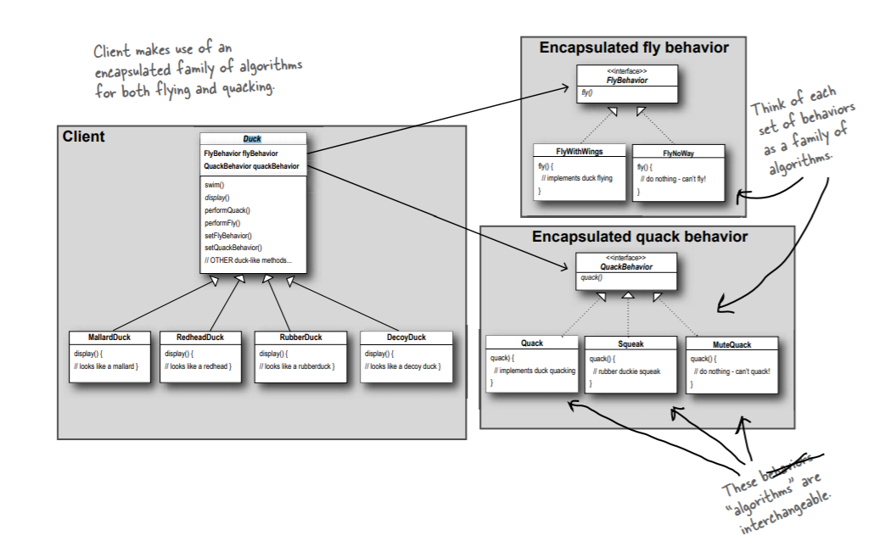

# L. The Liskov Substitution Principle

## Info

 It extends the Open/Closed Principle on the behavior of a superclass and its subtypes. 
 The principle defines that objects of a superclass shall be replaceable with objects of its subclasses without breaking the application.
 BLP represents a concept of subtyping, or subtype polymorphism.
  

## Pros 

1. Lower coupling -> Class will have fewer dependencies
2. Code re-usability
3. Easier maintenance

## Example

To follow BLP is used strategy pattern. 
Basically usage not only IS-A relationship, but HAS-A as well helps us fix BLP violation.  

Classic example of the pattern from Head First Design Patterns - Duck tales...

>***NOTE***
>
> Also we are using here composition,
> so it helps us follow one of design principle
> 'Favor composition over inheritance'. 
 